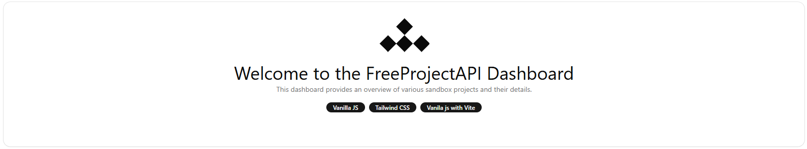
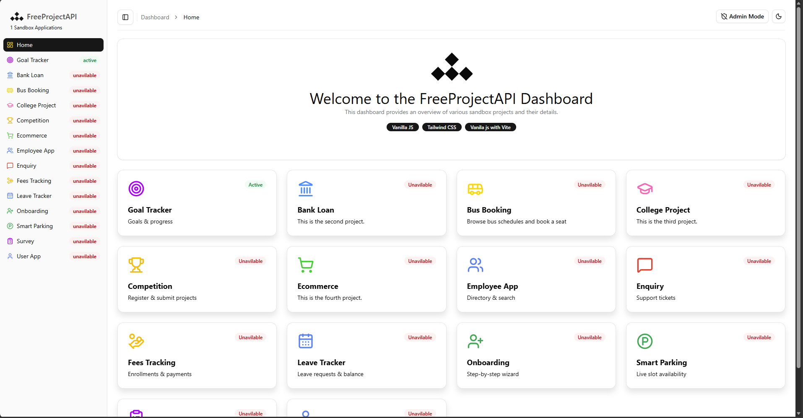
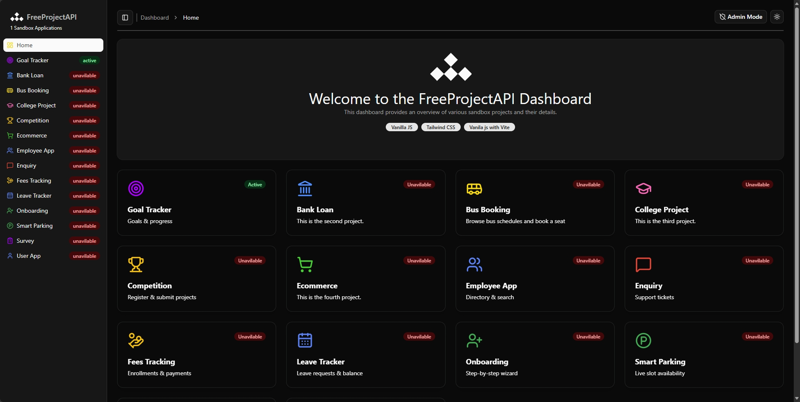

# FreeProjectAPI Sandbox Project Dashboard



A Vite single-page dashboard that brings several frontend application ideas into one workspace. It uses native JavaScript ES modules, Tailwind CSS, Basecoat CSS, Lucide icons, Chart.js, and the public [FreeProjectAPI](https://www.freeprojectapi.com/api.html) service.

## 🌐 Live Demo

[Open the FreeProjectAPI Sandbox Dashboard](https://sachintha-madubashana.github.io/FreeProjectAPI-Sandbox-Project-Dashboard/)

## 📖 Overview

The dashboard is a learning and demonstration project for modular frontend development, client-side routing, reusable UI components, local state, and API integration.

The currently implemented applications are:

- **Goal Tracker**: API-backed goals, milestones, tasks, reminders, charts, and productivity data.
- **Employee App**: employee search and pagination, and frontend admin CRUD flows.
- **Other projects**: dashboard cards and placeholder routes for planned applications.

Admin mode changes the frontend experience only. It is not an authentication or authorization system.

## 🧩 Features

- Single-page navigation with repository-base-path support
- Responsive dashboard layout
- Light and dark themes
- Local storage for theme, admin-mode, and Goal Tracker session state
- Reusable HTML-template and JavaScript components
- Toast notifications and loading, empty, and error states
- API requests through a shared request utility

## 📸 Screenshots

### Project Dashboard - Light Mode



### Project Dashboard - Dark Mode



## 📊 Project Status

| Project         | Status         |
| --------------- | -------------- |
| Goal Tracker    | 🟢 Active      |
| Employee App    | 🟢 Active      |
| Bank Loan       | 🔴 Unavailable |
| Bus Booking     | 🔴 Unavailable |
| College Project | 🔴 Unavailable |
| Competition     | 🔴 Unavailable |
| Ecommerce       | 🔴 Unavailable |
| Enquiry         | 🔴 Unavailable |
| Fees Tracking   | 🔴 Unavailable |
| Leave Tracker   | 🔴 Unavailable |
| Onboarding      | 🔴 Unavailable |
| Smart Parking   | 🔴 Unavailable |
| Survey          | 🔴 Unavailable |
| User App        | 🔴 Unavailable |

- 🟢 Active — implemented and available
- 🟡 Developing — currently being implemented
- 🔴 Unavailable — planned but not currently implemented

> Unavailable projects are planned applications that will be implemented progressively.

## 🧭 Main Routes

| Route           | Description                             |
| --------------- | --------------------------------------- |
| `/`             | Project dashboard                       |
| `/goal-tracker` | Goal Tracker application                |
| `/employee-app` | Employee directory and admin management |

> The remaining project cards currently lead to planned or placeholder pages.

## 🛠️ Tech Stack

| Technology                                   | Purpose                                    |
| -------------------------------------------- | ------------------------------------------ |
| **HTML5**                                    | Application structure                      |
| **CSS3**                                     | Styling and responsive UI                  |
| **JavaScript ES Modules**                    | Application logic and modular architecture |
| [**Vite**](https://vite.dev/)                | Development server and build tooling       |
| [**Tailwind CSS**](https://tailwindcss.com/) | Utility-first styling                      |
| [**Basecoat CSS**](https://basecoatui.com/)  | UI components and styling                  |
| [**Lucide**](https://lucide.dev/)            | Interface icons                            |
| [**Chart.js**](https://www.chartjs.org/)     | Data visualization                         |
| **Fetch API**                                | API communication                          |
| **Local Storage**                            | Client-side persistence                    |
| **FreeProjectAPI**                           | Public API backend                         |
| **GitHub Actions**                           | Automated deployment                       |
| **GitHub Pages**                             | Hosting                                    |

## 🔌 API

Goal Tracker and Employee App data is loaded from the public FreeProjectAPI endpoints. No API key is required by the endpoints currently used by this project. API availability can affect loading and CRUD operations at runtime.

Full API documentation: [FreeProjectAPI API Documentation](https://www.freeprojectapi.com/api.html)

## 🚀 Getting Started

### 1. Prerequisites

Make sure you have:

- Node.js
- npm
- A modern web browser
- Internet access for FreeProjectAPI requests

### 2. Installation

Clone the repository:

```bash
git clone https://github.com/sachintha-madubashana/FreeProjectAPI-Sandbox-Project-Dashboard
```

Navigate to the project:

```bash
cd FreeProjectAPI-Sandbox-Project-Dashboard
```

Install dependencies:

```bash
npm install
```

### 3. Development

Start the Vite development server:

```bash
npm run dev
```

Vite will provide a local development URL in the terminal.

### 4. Production Build

Create a production build:

```bash
npm run build
```

Preview the production build locally:

```bash
npm run preview
```

## 🚢 Deployment

The Vite configuration uses the GitHub Pages base path `/FreeProjectAPI-Sandbox-Project-Dashboard/`. The router supports both the repository base path in deployment and the root path during local development.

## ⚠️ Project Scope

This is primarily a frontend sandbox project.

The backend functionality is provided by the public FreeProjectAPI service rather than a backend developed specifically for this repository.

Therefore, the project is intended for:

- Learning
- Experimentation
- Academic work
- Portfolio demonstration

It is not intended to be used as a production platform.

## 🙏 Acknowledgements

This project uses FreeProjectAPI as the public API source for its applications.

## 📄 License

See the [LICENSE](LICENSE) file for details.

## 👨‍💻 Author

Sachintha Madubashana
